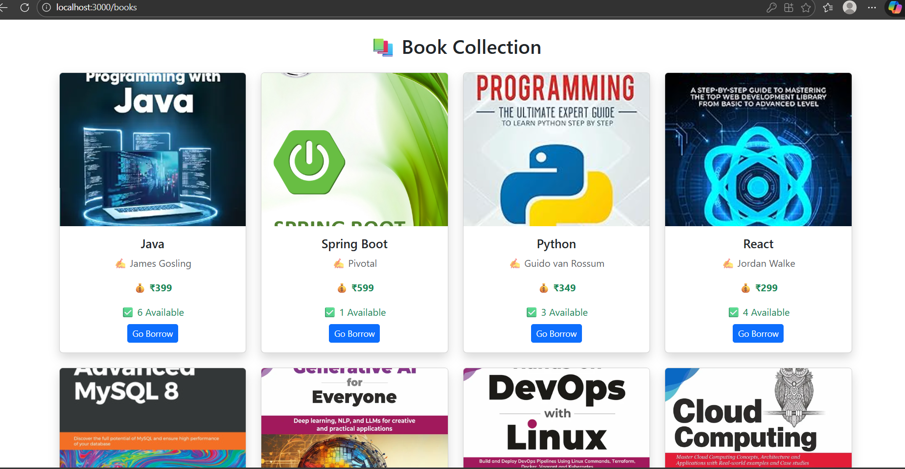
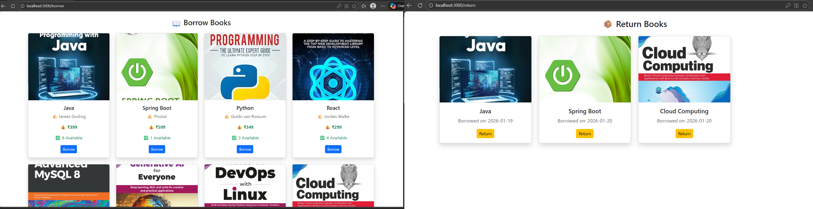

# 📚 LibroVault – BookNest
A Full Stack Library Management System built to manage books, users, and transactions efficiently.

---

## 🚀 Project Overview
LibroVault–BookNest is a web-based Library Management System designed for educational institutions.  
It helps librarians and users manage books, issue/return operations, and user authentication through a secure system.

---

## 🛠️ Tech Stack

### Frontend
- React.js
- Axios
- Bootstrap
- HTML, CSS, JavaScript

### Backend
- Java
- Spring Boot
- Spring Security
- JWT Authentication
- REST APIs

### Database
- MySQL

---

## ✨ Features
- User Registration & Login (JWT based authentication)
- Role-based access (Admin / User)
- Add, update, delete books (Admin)
- View available books
- Issue & return books
- Dashboard for users and admin
- Secure REST API integration


---

## 📂 Project Structure
```
LibroVault-BookNest/
│
├── backend/ # Spring Boot application
│├── src/
│└── pom.xml
│
├── frontend/ # React application
│├── src/
│└── package.json
│
├── .gitignore
└── README.md

```
---

## ▶️ How to Run the Project Locally

### Backend (Spring Boot)
1. Open backend folder in **STS**
2. Update `application.properties` with MySQL credentials
3. Run as **Spring Boot App**
4. Backend runs on:http://localhost:8080


---

### Frontend (React)
1. Open frontend folder in **VS Code**
2. Run:
```bash
npm install
npm start
```
3.Frontend runs on:
http://localhost:3000


---


## 🗄️ Database ER Diagram

The following ER diagram represents the database design of the Library Management System, showing entities and their relationships such as Users, Books, and Borrow records.


---

## 📸 Screenshots

### 🔐 Login Page


---

### 🏠 User Dashboard


---

### 📚 Book List


---

### 🔄 Borrow & Return Book



---

🔐 Authentication

JWT (JSON Web Token) is used for secure authentication

Tokens are generated on login and validated for protected APIs

🎯 Use Case

This project demonstrates:

Full Stack Development

REST API Design

Authentication & Authorization

Frontend–Backend integration

Real-world CRUD operations

👨‍💻 Developer

Gaurav Aswale

GitHub: https://github.com/GauravAs2003
